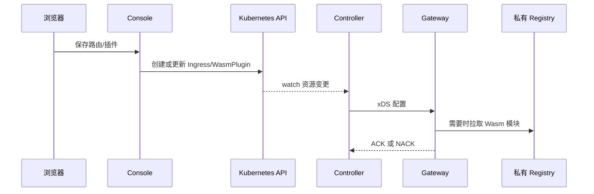
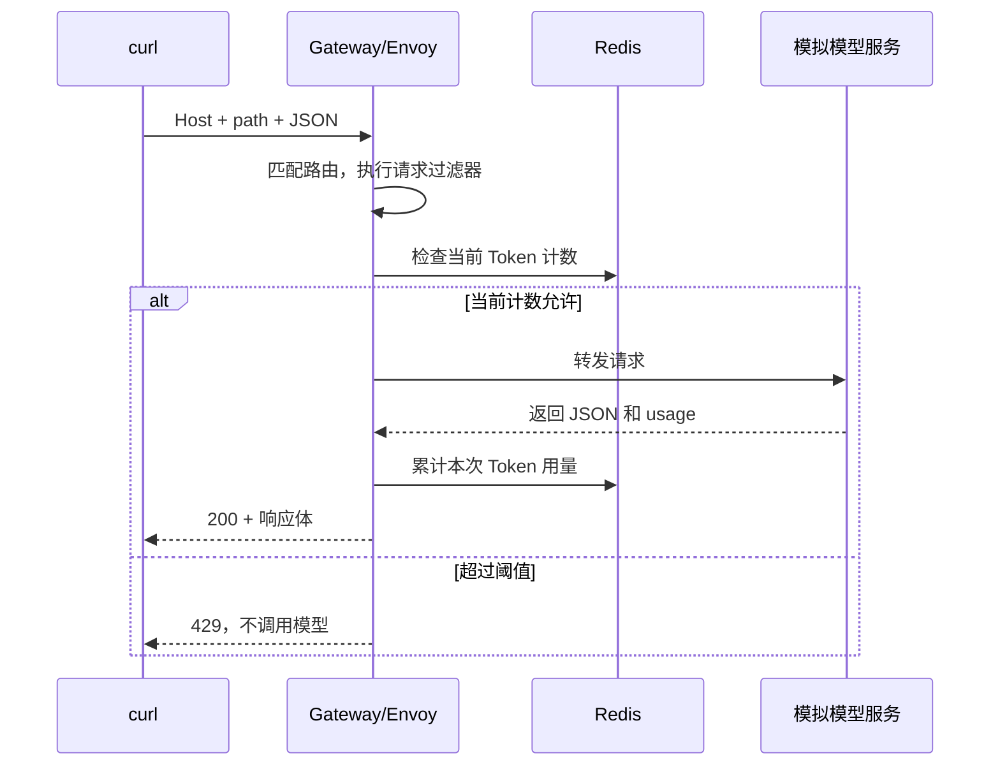

# Minikube HTTP 路由与 AI Token 插件私有化：动手及源码学习计划

本文是供你手动执行的教程。编写时没有执行 shell、kubectl、Docker、构建或部署命令，没有检查当前集群状态；下面的预期结果不能当作已经运行成功的记录。

暂将“AI token 插件”解释为 **AI Token 限流 `ai-token-ratelimit`**。`ai-statistics` 负责统计，`ai-quota` 负责配额管理，三者不是同一个插件。本实验同时镜像 AI 统计插件，兼顾不同版本的 Token 提取实现。

沿用此前环境：项目 `~/IdeaProjects/teaho-infra/higress-ai-demo`、context `higress-dev`、namespace `higress-system`、已有 Higress 与私有 Registry。本教程不重装集群、不替换已有模型路由。先使用本地模拟模型，不需要真实 API Key，也不会调用付费模型。

## 1. 先弄清这些对象分别做什么

| 名称 | 本实验中的作用 |
| --- | --- |
| Kubernetes / K8s | 保存资源配置，调度并维护容器 |
| Pod | 正在运行的容器实例 |
| Deployment | 声明应用镜像、副本数，负责维护 Pod |
| Service | 用稳定名称描述一组后端 Pod |
| Ingress | 声明 HTTP 域名、路径匹配及转发目标 |
| McpBridge | Higress 服务来源配置；这里使用 DNS 服务发现，与大模型 MCP 协议不是一回事 |
| WasmPlugin | 声明插件镜像、配置和生效范围的自定义资源 |
| Console | 管理界面，把你的操作变成 Kubernetes 资源 |
| Controller | 监听资源，转换并向 Gateway 下发配置 |
| Gateway | 真正处理请求，内部 Envoy 执行 HTTP 路由和 Wasm 插件 |
| Istio/Pilot | Higress 使用和扩展的配置生成、xDS 下发代码；无需另装完整 Istio |
| OCI Registry | 存放插件镜像；它不执行业务请求 |
| Redis | 保存 Token 限流计数 |

创建配置时：



业务请求时：



**正常业务请求不经过 Console 或 Controller。** 它们参与配置管理，不是 HTTP 转发的中转站。镜像拉取发生在配置加载/缓存需要时，也不是每次业务请求都拉一次。

本实验使用 `kubectl port-forward`，因此客户端到 Gateway 的入口经过 Kubernetes 的端口转发通道；生产 LoadBalancer/NodePort 的入口链路不同。Envoy 选中上游后也不一定经过 Service ClusterIP，可能直接连接发现到的 Pod endpoint。

## 2. 准备终端并确认已有环境

终端 A 执行：

```bash
cd ~/IdeaProjects/teaho-infra/higress-ai-demo
mkdir -p infra/minikube/route-teach
export CTX=higress-dev
export NS=higress-system
kubectl config get-contexts
kubectl --context "$CTX" -n "$NS" get deploy,svc,pods
kubectl --context "$CTX" get ingressclass
kubectl --context "$CTX" get crd wasmplugins.extensions.higress.io
kubectl --context "$CTX" -n "$NS" get mcpbridge default
```

`CTX` 是 kubeconfig 中的集群上下文名称，`NS` 是命名空间。它们只在当前终端有效；下文长期运行的端口转发直接写全 context 和 namespace。

若之前只是将组件缩容为 0，可手动启动：

```bash
kubectl --context "$CTX" -n "$NS" scale deployment/higress-controller --replicas=1
kubectl --context "$CTX" -n "$NS" rollout status deployment/higress-controller --timeout=180s
kubectl --context "$CTX" -n "$NS" scale deployment/higress-gateway --replicas=1
kubectl --context "$CTX" -n "$NS" rollout status deployment/higress-gateway --timeout=180s
kubectl --context "$CTX" -n "$NS" scale deployment/higress-console --replicas=1
kubectl --context "$CTX" -n "$NS" rollout status deployment/higress-console --timeout=180s
```

这些命令恢复已有 Deployment；如果对象不存在，应先完成原有集群搭建文档，不能用 scale 创建它。`rollout status` 等待部署就绪，不会创建新路由。

终端 B，保持运行，用浏览器打开 `http://127.0.0.1:18082`：

```bash
kubectl --context higress-dev -n higress-system port-forward svc/higress-console 18082:8080
```

终端 C，保持运行，用于业务请求：

```bash
kubectl --context higress-dev -n higress-system port-forward svc/higress-gateway 18081:80
```

看到 `Forwarding from 127.0.0.1:...` 才继续。端口被占用时换一个本地端口并同步修改后续 URL。Ctrl+C 会关闭转发。

## 3. 部署一个看得见请求的模拟后端

先创建 `infra/minikube/route-teach/backend.yaml`，粘贴以下完整内容。模拟服务返回固定 usage，适合验证插件流程；这不代表实际分词计数，也不是生产模型服务。

```yaml
apiVersion: v1
kind: ConfigMap
metadata:
  name: leon-route-backend
  namespace: higress-system
data:
  app.py: |
    import json
    from http.server import BaseHTTPRequestHandler, ThreadingHTTPServer
    class Handler(BaseHTTPRequestHandler):
        def handle_request(self):
            raw = self.rfile.read(int(self.headers.get('Content-Length', '0')))
            rid = self.headers.get('X-Request-ID', '')
            print(json.dumps({'method': self.command, 'path': self.path,
                              'host': self.headers.get('Host'), 'request_id': rid,
                              'user': self.headers.get('X-Demo-User'),
                              'body': raw.decode('utf-8', errors='replace')},
                             ensure_ascii=False), flush=True)
            status = 200
            if self.path == '/healthz':
                result = {'ok': True}
            elif self.command == 'POST' and self.path == '/v1/chat/completions':
                result = {'id': 'chatcmpl-route-teach', 'object': 'chat.completion',
                          'model': 'mock-model', 'choices': [{'index': 0,
                          'message': {'role': 'assistant', 'content': 'hello from local mock'},
                          'finish_reason': 'stop'}],
                          'usage': {'prompt_tokens': 12, 'completion_tokens': 8,
                                    'total_tokens': 20}}
            elif self.path.startswith('/echo'):
                result = {'source': 'leon-route-backend', 'method': self.command,
                          'path': self.path, 'host': self.headers.get('Host'),
                          'request_id': rid}
            else:
                status = 404
                result = {'source': 'leon-route-backend', 'error': 'mock path not found'}
            body = json.dumps(result).encode()
            self.send_response(status)
            self.send_header('Content-Type', 'application/json')
            self.send_header('Content-Length', str(len(body)))
            self.send_header('X-Demo-Upstream', 'leon-route-backend')
            self.end_headers()
            self.wfile.write(body)
        do_GET = handle_request
        do_POST = handle_request
    ThreadingHTTPServer(('0.0.0.0', 8080), Handler).serve_forever()
---
apiVersion: apps/v1
kind: Deployment
metadata:
  name: leon-route-backend
  namespace: higress-system
spec:
  replicas: 1
  selector:
    matchLabels: {app: leon-route-backend}
  template:
    metadata:
      labels: {app: leon-route-backend}
    spec:
      containers:
        - name: backend
          image: python:3.12-alpine
          command: [python, -u, /app/app.py]
          ports:
            - {name: http, containerPort: 8080}
          resources:
            requests: {cpu: 20m, memory: 32Mi}
            limits: {cpu: 200m, memory: 128Mi}
          readinessProbe:
            httpGet: {path: /healthz, port: 8080}
          volumeMounts:
            - {name: app, mountPath: /app, readOnly: true}
      volumes:
        - name: app
          configMap: {name: leon-route-backend}
---
apiVersion: v1
kind: Service
metadata:
  name: leon-route-backend
  namespace: higress-system
spec:
  selector: {app: leon-route-backend}
  ports:
    - {name: http, port: 8080, targetPort: 8080}
```

执行并观察：

```bash
kubectl --context "$CTX" apply -f infra/minikube/route-teach/backend.yaml
kubectl --context "$CTX" -n "$NS" rollout status deployment/leon-route-backend --timeout=180s
kubectl --context "$CTX" -n "$NS" get endpoints leon-route-backend
```

Endpoints 应包含 Pod IP 和 8080。没有地址时先检查 Pod readiness 和 Service selector，暂时不要排查网关。

## 4. 在 Console 创建服务来源和 HTTP 路由

### 4.1 Console 操作主线

不同 Console 版本菜单名称可能略有差别，按字段含义操作：

1. 打开“服务来源/服务发现”，新增 DNS 类型来源：名称 `leon-route-upstream`，域名 `leon-route-backend.higress-system.svc.cluster.local`，端口 `8080`，协议 HTTP（若有协议选项）。
2. 保存后应能在服务列表选到 `leon-route-upstream.dns`。这里解析的是集群内 Service 的 DNS。
3. 在域名管理添加 `route-teach.local`，使用 HTTP；本实验不配置证书、不启用 HTTPS 强制跳转。
4. 打开 HTTP 路由管理，新增名称 `leon-route-teach`。
5. 域名选择 `route-teach.local`；路径类型为前缀，路径 `/`；不限制方法，不添加 Header 匹配，不做路径重写。
6. 目标服务选择刚创建的 DNS 服务及 8080 端口；保存。
7. 此时先不要启用任何 AI 插件。

同时在浏览器开发者工具 Network 中观察保存操作。路由后台入口为 `/v1/routes`；记录请求 body，再对照第 11 节源码。前端代理可能给 URL 加前缀，按实际 Network 结果定位。

检查 Console 实际写入了什么：

```bash
kubectl --context "$CTX" -n "$NS" get ingress leon-route-teach -o yaml
kubectl --context "$CTX" -n "$NS" get mcpbridge default -o yaml
```

Console 生成的 Ingress 通常使用 `McpBridge` resource backend 和 `higress.io/destination` 注解，而不是直接写 `backend.service`。这两种写法都可能被网关支持，但 Console 对标准 Service backend 的编辑支持有限，不能据此判断路由无效。[Console 转换源码](https://github.com/higress-group/higress-console/blob/v2.2.4/backend/sdk/src/main/java/com/alibaba/higress/sdk/service/kubernetes/KubernetesModelConverter.java)

### 4.2 等价 YAML 路线：仅在没有通过 Console 创建时执行

不要再创建一条相同域名、相同路径的路由。以下供你理解和选择命令行创建；已完成 4.1 则跳过本小节。

保留已有 McpBridge 的其他来源，用 resourceVersion 做并发检查后添加实验来源：

```bash
kubectl --context "$CTX" -n "$NS" get mcpbridge default -o json > infra/minikube/route-teach/mcpbridge.before.json
jq '
  if any(.spec.registries[]?; .name == "leon-route-upstream") then
    error("来源已存在：请核对已有配置，不重复创建")
  else
    .spec.registries = ((.spec.registries // []) + [{
      name:"leon-route-upstream", type:"dns",
      domain:"leon-route-backend.higress-system.svc.cluster.local", port:8080
    }])
  end
  | del(.metadata.managedFields, .status)
' infra/minikube/route-teach/mcpbridge.before.json > infra/minikube/route-teach/mcpbridge.updated.json
```

只有 jq 成功且文件内容正确，才执行：

```bash
kubectl --context "$CTX" -n "$NS" replace -f infra/minikube/route-teach/mcpbridge.updated.json
```

若 `default` 不存在，先用 Console 创建服务来源；若返回 Conflict，重新读取并合并，不能强制覆盖其他人的修改。

保存为 `infra/minikube/route-teach/route.yaml`：

```yaml
apiVersion: networking.k8s.io/v1
kind: Ingress
metadata:
  name: leon-route-teach
  namespace: higress-system
  labels:
    higress.io/resource-definer: higress
  annotations:
    higress.io/destination: leon-route-upstream.dns:8080
spec:
  ingressClassName: higress
  rules:
    - host: route-teach.local
      http:
        paths:
          - path: /
            pathType: Prefix
            backend:
              resource:
                apiGroup: networking.higress.io
                kind: McpBridge
                name: default
```

```bash
kubectl --context "$CTX" apply -f infra/minikube/route-teach/route.yaml
```

`host` 决定匹配请求的 Host；`Prefix /` 覆盖该域名下全部路径；`destination` 决定上游；`ingressClassName` 指定处理它的控制器类别。

### 4.3 先证明路由能用

```bash
curl --noproxy '*' -si http://127.0.0.1:18081/echo/hello \
  -H 'Host: route-teach.local'
curl --noproxy '*' -si http://127.0.0.1:18081/v1/chat/completions \
  -H 'Host: route-teach.local' -H 'Content-Type: application/json' \
  -d '{"model":"mock-model","messages":[{"role":"user","content":"Hello"}],"stream":false}'
```

应分别看到 echo JSON 和带 `usage.total_tokens: 20` 的模型格式响应；两者都有 `X-Demo-Upstream: leon-route-backend`。不需要在电脑 hosts 文件添加域名，因为 curl 已显式指定 Host。`--noproxy '*'` 避免本地代理改变访问路径。

## 5. 准备 Redis，并确保其上游配置下发

保存为 `infra/minikube/route-teach/redis.yaml`：

```yaml
apiVersion: apps/v1
kind: Deployment
metadata:
  name: leon-token-redis
  namespace: higress-system
spec:
  replicas: 1
  selector:
    matchLabels: {app: leon-token-redis}
  template:
    metadata:
      labels: {app: leon-token-redis}
    spec:
      containers:
        - name: redis
          image: redis:7.2-alpine
          ports:
            - {name: tcp-redis, containerPort: 6379}
          resources:
            requests: {cpu: 20m, memory: 32Mi}
            limits: {cpu: 200m, memory: 128Mi}
          readinessProbe:
            exec:
              command: [redis-cli, ping]
---
apiVersion: v1
kind: Service
metadata:
  name: leon-token-redis
  namespace: higress-system
spec:
  selector: {app: leon-token-redis}
  ports:
    - {name: tcp-redis, port: 6379, targetPort: 6379}
---
# 显式引用 Redis，使“仅下发路由关联上游”的配置也能包含它。
# 该保留域名不供业务使用；不要把 HTTP 请求发到 Redis。
apiVersion: networking.k8s.io/v1
kind: Ingress
metadata:
  name: leon-token-redis-reference
  namespace: higress-system
spec:
  ingressClassName: higress
  rules:
    - host: redis-reference.route-teach.invalid
      http:
        paths:
          - path: /
            pathType: Prefix
            backend:
              service:
                name: leon-token-redis
                port: {number: 6379}
```

```bash
kubectl --context "$CTX" apply -f infra/minikube/route-teach/redis.yaml
kubectl --context "$CTX" -n "$NS" rollout status deployment/leon-token-redis --timeout=180s
kubectl --context "$CTX" -n "$NS" exec deployment/leon-token-redis -- redis-cli ping
```

应返回 `PONG`。这个 Redis 无持久卷、无密码，仅供当前本地实验；重建 Pod 可能丢失计数。插件配置使用 Service FQDN，后面还必须在 Gateway `/clusters` 中验证该上游。Higress 的 `onlyPushRouteCluster` 会影响没有路由引用的服务是否下发，不要仅凭 Service 存在就认定可用。[插件 Redis 配置说明](https://github.com/higress-group/higress/blob/v2.2.4/plugins/wasm-go/extensions/ai-token-ratelimit/README.md)

## 6. 将官方插件镜像复制到已有私有 Registry

本节的“私有化”是保留官方 Wasm 镜像格式、复制到自己的仓库后使用。它不要求重新编译 Wasm；源码构建是另一个实验，可参照 `minikube-wasm-implement-codex.md`。不要把官方层解压后随意用 `oras push` 重组，否则可能再次遇到 mediaType/层数错误。

### 6.1 确认 Registry 和凭据

此前使用的是 Docker Distribution `registry:2.8.3`，不是 Harbor：

```bash
kubectl --context "$CTX" -n "$NS" get deploy,svc,pvc | rg codex-private-wasm
kubectl --context "$CTX" -n "$NS" get secret codex-private-wasm-pull \
  -o jsonpath='{.type}{"\n"}'
```

Secret 类型应为 `kubernetes.io/dockerconfigjson`。本教程依赖该 Registry 已建立；若不存在，先按 `minikube-source-build-cluster-codex.md` 的私有仓库章节部署。不要无意中新建同名仓库覆盖已有存储。

终端 D，保持运行直到复制和校验完成：

```bash
kubectl --context higress-dev -n higress-system port-forward svc/codex-private-wasm-registry 15006:5000
```

终端 A：

```bash
curl --noproxy '*' -si http://127.0.0.1:15006/v2/
oras version
```

未带认证返回 401 可证明 Registry 可达；`connection refused` 表示端口转发未成功，不是插件格式错误。需要已安装 ORAS 1.x，安装方法见 [ORAS 官方说明](https://oras.land/docs/installation/)。

### 6.2 为电脑上的 ORAS 准备临时认证

集群 Secret 的主机键名是集群 DNS，电脑推送则访问 localhost，因此需要转换键名，不修改原 Secret：

```bash
export WASM_DOCKER_CONFIG=$(mktemp -d /tmp/leon-token-auth.XXXXXX)
python3 - <<'PY'
import base64, json, os, subprocess
from pathlib import Path
raw = subprocess.check_output([
    'kubectl', '--context', 'higress-dev', '-n', 'higress-system',
    'get', 'secret', 'codex-private-wasm-pull', '-o', 'json'])
secret = json.loads(raw)
assert secret['type'] == 'kubernetes.io/dockerconfigjson'
data = json.loads(base64.b64decode(secret['data']['.dockerconfigjson']))
host = 'codex-private-wasm-registry.higress-system.svc.cluster.local:5000'
p = Path(os.environ['WASM_DOCKER_CONFIG']) / 'config.json'
with p.open('x') as f:
    os.chmod(p, 0o600)
    json.dump({'auths': {'localhost:15006': data['auths'][host]}}, f)
print('Temporary registry credentials prepared')
PY
```

不要把临时 config.json、Secret 内容或整个包含凭据的 config_dump 提交 Git。

### 6.3 复制并核对 digest

Console v2.2.4 的内置清单给这两个插件配置的版本都是 2.0.1；标签不是不可变标识，实际以本次 resolve 得到的 digest 为准。[内置插件清单](https://github.com/higress-group/higress-console/blob/v2.2.4/backend/sdk/src/main/resources/plugins/plugins.properties)

```bash
for PLUGIN in ai-token-ratelimit ai-statistics; do
  SRC="higress-registry.cn-hangzhou.cr.aliyuncs.com/plugins/$PLUGIN"
  DST="localhost:15006/plugins/$PLUGIN"
  DIGEST=$(oras resolve "$SRC:2.0.1") || break
  oras cp --to-plain-http \
    --to-registry-config "$WASM_DOCKER_CONFIG/config.json" \
    "$SRC@$DIGEST" "$DST:2.0.1" || break
  COPIED=$(oras resolve --plain-http \
    --registry-config "$WASM_DOCKER_CONFIG/config.json" "$DST:2.0.1") || break
  test "$DIGEST" = "$COPIED" || break
  printf '%s %s\n' "$PLUGIN" "$DIGEST"
done
```

必须看到两个插件都输出名称和匹配的 digest，才算复制校验完成；`break` 后退出循环不代表两者都成功。记录这两行作为实验版本证据。ORAS 的 `cp` 复制已有 OCI 对象，避免重新打包改变格式。[复制参数](https://oras.land/docs/commands/oras_cp/)、[digest 查询参数](https://oras.land/docs/commands/oras_resolve/)

Gateway 使用的地址是 `oci://codex-private-wasm-registry.higress-system.svc.cluster.local:5000/plugins/...`，**不能写 `localhost:15006`**：Pod 的 localhost 是 Pod 自己。

### 6.4 Gateway 如何允许本地 HTTP Registry

先查看现有值：

```bash
kubectl --context "$CTX" -n "$NS" get deployment higress-gateway -o json |
  jq '.spec.template.spec.containers[] | {name, env: [.env[]? | select(.name == "WASM_INSECURE_REGISTRIES")]}'
```

已有值包含 `codex-private-wasm-registry.higress-system.svc.cluster.local:5000` 时不要改。确实缺少时，编辑 Deployment，将该地址追加到原逗号分隔列表中，保留其他仓库：

```bash
kubectl --context "$CTX" -n "$NS" edit deployment higress-gateway
```

相关结构如下，实际值要合并现有内容：

```yaml
spec:
  template:
    spec:
      containers:
        - name: higress-gateway
          env:
            - name: WASM_INSECURE_REGISTRIES
              value: codex-private-wasm-registry.higress-system.svc.cluster.local:5000
```

保存会触发 Gateway 滚动更新；等待就绪后，必要时重新启动终端 C 的端口转发。同步把设置写回原 Helm values 的 `gateway.env`，避免以后 Helm 升级覆盖手工修改。生产 HTTPS 仓库优先配置可信证书，不能把 insecure 当成认证凭据。

## 7. 部署插件：先用可审查 YAML，再理解 Console 的对应操作

### 7.1 主线：独立实验 WasmPlugin

使用独立资源名和路由范围，避免改动现有全局插件。**执行前在 Console 检查本实验路由是否已继承其他 Token 限流/AI 统计实例；同一路由避免重复加载同类插件。**

保存为 `infra/minikube/route-teach/plugins.yaml`：

```yaml
apiVersion: extensions.higress.io/v1alpha1
kind: WasmPlugin
metadata:
  name: leon-route-token-limit
  namespace: higress-system
spec:
  url: oci://codex-private-wasm-registry.higress-system.svc.cluster.local:5000/plugins/ai-token-ratelimit:2.0.1
  imagePullSecret: codex-private-wasm-pull
  imagePullPolicy: IfNotPresent
  phase: UNSPECIFIED_PHASE
  priority: 600
  defaultConfigDisable: true
  matchRules:
    - ingress: [leon-route-teach]
      config:
        rule_name: leon-route-teach
        rule_items:
          - limit_by_per_header: x-demo-user
            limit_keys:
              - key: '*'
                token_per_minute: 10
        rejected_code: 429
        rejected_msg: leon-route-teach token limit exceeded
        redis:
          service_name: leon-token-redis.higress-system.svc.cluster.local
          service_port: 6379
          timeout: 1000
---
apiVersion: extensions.higress.io/v1alpha1
kind: WasmPlugin
metadata:
  name: leon-route-token-statistics
  namespace: higress-system
spec:
  url: oci://codex-private-wasm-registry.higress-system.svc.cluster.local:5000/plugins/ai-statistics:2.0.1
  imagePullSecret: codex-private-wasm-pull
  imagePullPolicy: IfNotPresent
  phase: UNSPECIFIED_PHASE
  priority: 900
  defaultConfigDisable: true
  matchRules:
    - ingress: [leon-route-teach]
      config: {}
```

```bash
kubectl --context "$CTX" apply --dry-run=server -f infra/minikube/route-teach/plugins.yaml
kubectl --context "$CTX" apply -f infra/minikube/route-teach/plugins.yaml
```

服务器 dry-run 校验通过只能说明资源格式被 API 接受；它不会替 Gateway 下载插件，也不会证明 Redis 可访问。

字段解释：`url` 是模块来源；`imagePullSecret` 是同 namespace 的拉取凭据名称；它不是 Pod 的 `imagePullSecrets`。`defaultConfigDisable: true` 配合 `matchRules.ingress` 将实验限制到指定 Ingress。`config` 才是传给插件的业务配置，不要把整个 WasmPlugin YAML 粘进插件的配置编辑框。

`x-demo-user` 的值分别计数；这是演示分组方式，用户可自己伪造该头，生产中应使用经过认证的消费者身份。请求使用普通 OpenAI 格式且后端直接接受，所以本实验不必加 ai-proxy 做协议转换。

优先级取自 Console 插件定义：[Token 限流](https://github.com/higress-group/higress-console/blob/v2.2.4/backend/sdk/src/main/resources/plugins/ai-token-ratelimit/spec.yaml)、[AI 统计](https://github.com/higress-group/higress-console/blob/v2.2.4/backend/sdk/src/main/resources/plugins/ai-statistics/spec.yaml)。源码版本之间统计依赖有变化，保留统计插件并以第 9 节 Redis 与响应验证为准，不能仅凭配置名称认定工作正常。

### 7.2 Console 路线：作为 7.1 的替代，不重复启用

如果你希望整个插件配置通过 Console 完成，跳过 7.1 的 apply：

1. 在原 Console Helm values 确认以下设置，仍用原有 Helm release 和 chart 升级流程，不另装一个 Console：

   ```yaml
   pluginServer:
     imageRegistry: codex-private-wasm-registry.higress-system.svc.cluster.local:5000
     imageNamespace: plugins
   podEnvs:
     HIGRESS_ADMIN_WASM_PLUGIN_IMAGE_PULL_SECRET: codex-private-wasm-pull
   ```

2. 设置只是让 Console 生成私有 URL 和 Secret 引用，不等于启用了一个 pluginServer Pod；本方案直接从 OCI Registry 拉取，不需要额外 pluginServer 服务。
3. 打开 `leon-route-teach` 的路由级插件配置，启用“AI Token 限流”，将 7.1 `config` 下从 `rule_name` 到 `redis` 的内容粘入配置编辑器。确认生效范围为当前路由，不是全局。
4. 同样在该路由启用“AI 统计”，配置 `{}` 即可。
5. Console 可能使用已有共享 WasmPlugin 并追加 matchRules；读取实际资源，确认当前路由规则、URL、Secret。不要假定资源名一定是本教程的两个名称。

   ```bash
   kubectl --context "$CTX" -n "$NS" get wasmplugins -o json |
     jq '.items[] | {name:.metadata.name, url:.spec.url,
       imagePullSecret:.spec.imagePullSecret, matchRules:.spec.matchRules}'
   ```

6. 若是此前已存在、仍指向官方仓库的共享插件，Console 的新默认值不会自动回写它。核对是否还有其他路由引用，并在其资源中改 `spec.url` 与 `spec.imagePullSecret`。这会影响该资源所有使用者；本次只练习独立路由时，优先使用 7.1 的独立资源方案。

不要为了“让 Console 看见”手改插件的内部标签。直接创建的资源在某些 Console 版本可能只读或不显示；以 Kubernetes 资源和 Gateway 运行状态为准。Console 操作对应源码见第 11 节。

## 8. 判断配置是否真正加载

新终端 E，连接某个 Gateway 实例的 Envoy admin，保持运行：

```bash
kubectl --context higress-dev -n higress-system port-forward deployment/higress-gateway 15000:15000
```

若有多个 Gateway 副本，这只检查其中一个；排障时应指定 Pod 分别检查。当前实验先使用一个副本，便于将业务与 admin 对到同一实例。

终端 A 保存诊断数据到临时目录，不放 Git 仓库：

```bash
export DIAG=$(mktemp -d /tmp/leon-route-diag.XXXXXX)
curl --noproxy '*' -fsS http://127.0.0.1:15000/config_dump > "$DIAG/config.json"
```

### 8.1 路由：RDS

```bash
jq '.configs[] | select(."@type" | endswith("RoutesConfigDump"))
  | .dynamic_route_configs[]?.route_config.virtual_hosts[]?
  | select(any(.domains[]?; contains("route-teach.local")))
  | {name,domains,routes}' "$DIAG/config.json"
```

应看到域名、`/` 的匹配条件，以及目标 cluster。没有输出时，先检查 Ingress class、Controller 日志和资源是否在其 watch 范围内。

### 8.2 Listener：只看 active，并单独检查失败配置

```bash
jq '.configs[] | select(."@type" | endswith("ListenersConfigDump"))
  | .dynamic_listeners[]?
  | {name,active: (.active_state != null),warming: (.warming_state != null),
     error: .error_state.details}' "$DIAG/config.json"

jq '.configs[] | select(."@type" | endswith("ListenersConfigDump"))
  | .dynamic_listeners[]?.active_state.listener
  | .. | objects | select(has("http_filters"))
  | .http_filters[] | {name,config_discovery}' "$DIAG/config.json"
```

仅在全文搜索到插件名字不够：它可能在 `error_state.failed_configuration` 中。即使存在 active Listener，也可能是旧版本；要核对里面引用的插件名字、版本和更新状态。

### 8.3 ECDS：已接受的动态扩展配置

```bash
jq '.configs[] | select(."@type" | endswith("EcdsConfigDump"))
  | .ecds_filters[]?
  | {name:.ecds_filter.name,version_info,last_updated,
     type:.ecds_filter.typed_config."@type"}' "$DIAG/config.json"
```

在相应 Listener 的 `config_discovery` 和这里的扩展中对应到本实验插件。部分版本用内联 Wasm 配置而不显示该 ECDS 结构，应查看 active Listener 的 `typed_config`；缺少这一段输出本身不足以判定加载失败。避免把完整 typed_config 粘到公共渠道，里面可能包含拉取凭据。

### 8.4 Redis cluster、错误日志和计数

```bash
curl --noproxy '*' -fsS http://127.0.0.1:15000/clusters |
  rg 'leon-token-redis|cx_connect_fail|rq_error'
curl --noproxy '*' -fsS 'http://127.0.0.1:15000/stats?filter=wasm%7Cupdate_rejected%7Cconfig_fail'
kubectl --context "$CTX" -n "$NS" logs deployment/higress-gateway \
  -c higress-gateway --since=10m |
  rg -i 'leon-route|wasm|redis|error|reject|unauthorized'
kubectl --context "$CTX" -n "$NS" logs deployment/higress-controller \
  -c discovery --since=10m | rg -i 'ECDS|NACK|ACK ERROR|credential|secret'
```

先用 `get pod -o jsonpath='{.spec.containers[*].name}'` 核实容器名；若当前 Controller 没有 discovery 容器，选实际承载 Pilot 的容器。旧错误可能保留，重点观察本次更新时间及错误计数是否继续增长。

Redis cluster 不存在时，即使 `redis-cli ping` 成功插件也不能调用它：先检查第 5 节引用路由是否被接收、RDS 目标是否为相应 Service，以及 Controller 的服务发现配置；不要靠重复重启碰运气。

## 9. 验证 Token 限流确实作用于请求

先生成一个新用户标识，排除上一次计数影响：

```bash
export DEMO_USER="leon-$(date +%s)"
export RID1=$(cat /proc/sys/kernel/random/uuid)
curl --noproxy '*' -si http://127.0.0.1:18081/v1/chat/completions \
  -H 'Host: route-teach.local' -H 'Content-Type: application/json' \
  -H "X-Demo-User: $DEMO_USER" -H "X-Request-ID: $RID1" \
  -d '{"model":"mock-model","messages":[{"role":"user","content":"Hello"}],"stream":false}'
```

预期第一次 200，返回用量 20。插件依据已累计用量判断，不知道未来模型响应会消耗多少，因此首次请求可以超过阈值 10；这不是严格的预付费余额机制，并发请求也可能超额。

等待异步写入，然后在同一分钟窗口内再次请求：

```bash
sleep 2
export RID2=$(cat /proc/sys/kernel/random/uuid)
curl --noproxy '*' -si http://127.0.0.1:18081/v1/chat/completions \
  -H 'Host: route-teach.local' -H 'Content-Type: application/json' \
  -H "X-Demo-User: $DEMO_USER" -H "X-Request-ID: $RID2" \
  -d '{"model":"mock-model","messages":[{"role":"user","content":"Hello again"}],"stream":false}'
kubectl --context "$CTX" -n "$NS" exec deployment/leon-token-redis -- \
  redis-cli --scan --pattern '*leon-route-teach*'
```

预期第二次 429，响应体为 `leon-route-teach token limit exceeded`。如果恰好跨分钟，可用新用户重新连续测试。将扫描得到的实际 key 粘入下面命令，查看数值和过期时间；不要使用 `FLUSHALL`：

```bash
kubectl --context "$CTX" -n "$NS" exec deployment/leon-token-redis -- redis-cli GET '这里替换成扫描得到的完整key'
kubectl --context "$CTX" -n "$NS" exec deployment/leon-token-redis -- redis-cli TTL '这里替换成扫描得到的完整key'
kubectl --context "$CTX" -n "$NS" logs deployment/leon-route-backend --since=5m |
  jq -R 'fromjson? | select(.path == "/v1/chat/completions")'
```

后端日志应看见第一次请求，而被拦截的第二次不应到达后端。Gateway 可能按配置重新生成 X-Request-ID；若 RID 不一致，用返回或后端记录的 ID，并结合 `x-demo-user` 和时间关联。

再换一个 `X-Demo-User`，预期又可获得第一次 200，证明按用户分别计数。最终证据组合为：私有镜像 digest 匹配、active 配置、无新增加载错误、Redis 计数变化、200→429、429 请求未到后端。

持续返回 200 时依次检查：路由规则是否匹配、请求头是否存在、插件是否 active、Redis cluster/连接是否正常、响应是否有 usage、运行镜像与所读源码是否同版本。Redis 错误可能放行，不能把“没有 429”直接解释成额度充足。

## 10. 区分 Gateway 404、插件错误和上游错误

| 证据 | 更可能的位置 | 下一步 |
| --- | --- | --- |
| `response_flags=NR`、`response_code_details=route_not_found`，无上游 | Gateway 路由未匹配 | 检查 Host、path、RDS 与 Ingress |
| Wasm 拉取失败、ECDS NACK、Listener error_state | 插件加载/配置阶段 | 检查 URL、格式、Secret、TLS、插件解析日志 |
| 429 和本实验自定义文案，后端没有该次请求 | Token 插件主动拒绝 | 查看 Redis 计数及规则 |
| 404 且 `X-Demo-Upstream` 存在、后端记录请求 | 模拟后端返回 | 查看实际 path，检查重写 |
| 上游地址与 upstream service time 存在，响应来自 nginx/Kong | 某个上游代理返回 | 核实 cluster、Host、SNI、路径，不能只凭 server 头认定是模型官方 |
| 503、UF/UH 或连接失败原因 | 上游连接/健康问题 | 检查 endpoint、端口、TLS/网络 |

用错误路径做对照实验：

```bash
curl --noproxy '*' -si http://127.0.0.1:18081/not-exist -H 'Host: route-teach.local'
curl --noproxy '*' -si http://127.0.0.1:18081/echo -H 'Host: unknown.route-teach.invalid'
```

第一条命中 `/` 路由，再由 mock 返回 404；第二条在没有其他兜底路由的前提下应由 Gateway 返回未匹配。若集群存在 wildcard 路由，第二条可能被其接收，以 RDS 和日志为准。

若 Gateway 已启用 JSON access log，可筛选如下；字段名称依赖实际 access-log 模板：

```bash
kubectl --context "$CTX" -n "$NS" logs deployment/higress-gateway \
  -c higress-gateway --since=5m |
  jq -R 'fromjson? | select(.authority == "route-teach.local") |
    {request_id,route_name,method,authority,path,response_code,
     response_code_details,response_flags,upstream_cluster,upstream_host,
     upstream_service_time,upstream_transport_failure_reason}'
```

无输出可能是非 JSON 日志、字段名不同、没有启用 access log 或选错副本，不等于没有请求。先看原始日志。jq 外层用单引号，内部字符串用双引号，例如 `.method == "POST"`。

**如何看实际转发请求和响应？** 本实验后端日志记录收到的 method/path/Host/body，curl 显示下游收到的响应，二者配合最直观。真实 HTTPS 模型请求无法靠普通 tcpdump 直接读出明文；可在受控测试中临时将路由上游切到模拟服务观察改写，或按所用版本配置 Envoy tap/上游调试日志。普通 access log 不会自动记录完整请求体、上游请求头或响应体；Console 也不是抓包工具。涉及真实用户内容或 API Key 时不要照搬本实验的 body 日志。

## 11. 按创建流程逐个读源码

以下是端到端主链路的入口清单，不是全部依赖库和间接调用文件的穷举。公开链接以 Higress/Console v2.2.4 为学习参考；**没有读取本机源码，也没有证明当前运行镜像恰好由这些提交构建**。本机分支可能使用 `external/istio`，另一些版本使用 `istio/istio`，以 git 子模块和 go.mod replace 为准，不能混用上游 Istio main 与 Higress fork。

### 11.1 先记录版本，定位本机目录

以下命令由你手动执行，目录不存在时改成实际 checkout：

```bash
export HIGRESS_SRC=~/IdeaProjects/agentspace/higress
export CONSOLE_SRC=~/IdeaProjects/agentspace/higress-console
git -C "$HIGRESS_SRC" rev-parse HEAD
git -C "$CONSOLE_SRC" rev-parse HEAD
git -C "$HIGRESS_SRC" submodule status
rg -n 'istio|envoy|replace' "$HIGRESS_SRC/.gitmodules" "$HIGRESS_SRC/go.mod"
kubectl --context "$CTX" -n "$NS" get pods -o json |
  jq '.items[] | {pod:.metadata.name,containers:[.status.containerStatuses[]? | {name,image,imageID}]}'
```

记录源代码提交、镜像 imageID 和两个 Wasm digest。源码 tag 与插件 tag 的编号不能直接相互推导；没有构建出处时，只能说“对应逻辑的参考源码”，不能声称源码和二进制逐行一致。

### 11.2 Console：点击保存如何变成 Kubernetes 资源

以下路径相对 `$CONSOLE_SRC`：

| 顺序 | 文件入口 | 学习重点 |
| --- | --- | --- |
| 1 | `frontend/src/services/route.ts` | 浏览器如何发路由增删改查 HTTP 请求 |
| 2 | `backend/console/src/main/java/com/alibaba/higress/console/controller/RoutesController.java` | `/v1/routes`；`add`/`update` 校验并调用服务 |
| 3 | `backend/sdk/src/main/java/com/alibaba/higress/sdk/service/RouteServiceImpl.java` | `add` 调 `route2Ingress`，再创建 Ingress |
| 4 | `backend/sdk/src/main/java/com/alibaba/higress/sdk/service/kubernetes/KubernetesModelConverter.java` | `route2Ingress`；域名、路径、注解、backend 如何编码 |
| 5 | `backend/sdk/src/main/java/com/alibaba/higress/sdk/service/kubernetes/KubernetesClientService.java` | 查 `createIngress`/`replaceIngress`，找到真正访问 API Server 的代码 |
| 6 | `backend/console/src/main/java/com/alibaba/higress/console/controller/WasmPluginsController.java` | 插件管理 HTTP API |
| 7 | `backend/sdk/src/main/java/com/alibaba/higress/sdk/service/WasmPluginServiceImpl.java` | 插件定义、镜像 URL、拉取 Secret 的生成 |
| 8 | `backend/sdk/src/main/java/com/alibaba/higress/sdk/service/WasmPluginInstanceServiceImpl.java` | 路由/域名/全局实例配置与 matchRules 的对应关系 |
| 9 | `backend/sdk/src/main/java/com/alibaba/higress/sdk/model/wasmplugin/WasmPluginServiceConfig.java` | Console 私有仓库环境配置如何读入 |
| 10 | `backend/sdk/src/main/resources/plugins/ai-token-ratelimit/spec.yaml` 与 `plugins.properties` | 表单 schema、默认优先级、官方镜像版本 |

前端页面随版本可能调整，不猜文件名；从已确认的 service 向上找调用者：

```bash
rg -n 'services/route|/v1/routes|wasmPlugin|wasm-plugin' "$CONSOLE_SRC/frontend/src"
rg -n 'createIngress|route2Ingress|setImagePullSecret|setUrl' "$CONSOLE_SRC/backend"
rg -n 'class .*WasmPlugin.*Controller|WasmPluginInstanceService' "$CONSOLE_SRC/backend"
```

第一轮只跟一个字段：把路径 `/echo` 从 Network 请求追到 `Ingress.spec.rules[].http.paths[].path`。第二轮跟 `spec.url` 与 `imagePullSecret`。这比一开始阅读整个项目更容易。

可直接开始阅读：[RoutesController](https://github.com/higress-group/higress-console/blob/v2.2.4/backend/console/src/main/java/com/alibaba/higress/console/controller/RoutesController.java)、[RouteServiceImpl](https://github.com/higress-group/higress-console/blob/v2.2.4/backend/sdk/src/main/java/com/alibaba/higress/sdk/service/RouteServiceImpl.java)。

### 11.3 Higress Controller：监听、转换和触发推送

以下路径相对 `$HIGRESS_SRC`：

| 文件入口 | 看什么 |
| --- | --- |
| `cmd/higress/main.go` | 进程进入 `cmd.GetRootCommand().Execute()` |
| `pkg/cmd/server.go` | serve 命令、Ingress class/watch namespace、服务器启动参数 |
| `pkg/bootstrap/server.go` | `NewServer`、`initConfigController`、`initRegistryEventHandlers` 和 `ConfigUpdate` |
| `pkg/ingress/translation/translation.go` | `NewIngressTranslation`、路由/域名集合、配置类型转换入口 |
| `pkg/ingress/kube/ingress/controller.go` | Ingress informer、事件队列、路由转换；新版本可能另有 v1 controller |
| `pkg/ingress/config/` | 沿 `NewIngressConfig`/`NewKIngressConfig` 查实际选择的控制器与聚合逻辑 |
| `pkg/ingress/kube/annotations/` | `higress.io/destination` 等注解如何解析 |
| `pkg/ingress/mcp/` | 服务来源与内部配置传递相关代码，沿 bootstrap 的调用继续跟踪 |

```bash
rg -n 'NewIngressConfig|NewKIngressConfig|AddEventHandler|ConfigUpdate|WasmPlugin' \
  "$HIGRESS_SRC/pkg/ingress" "$HIGRESS_SRC/pkg/bootstrap"
rg -n 'destination|Destination' "$HIGRESS_SRC/pkg/ingress/kube/annotations"
```

从 informer 注册函数进入，找到队列消费函数，再追转换结果和 `ConfigUpdate`，不要把“API Server 保存成功”当成“Gateway 收到成功”。在双容器部署中，还要读 `higress-core` 与 `discovery` 的启动参数，确认当前版本内部配置传递方式；不要假定任何版本都是完全相同的进程拓扑。

参考：[bootstrap](https://github.com/higress-group/higress/blob/v2.2.4/pkg/bootstrap/server.go)、[translation](https://github.com/higress-group/higress/blob/v2.2.4/pkg/ingress/translation/translation.go)、[Ingress controller](https://github.com/higress-group/higress/blob/v2.2.4/pkg/ingress/kube/ingress/controller.go)。

### 11.4 Istio/Pilot：内部配置变成 xDS

将 `$ISTIO_SRC` 设置为 11.1 找到的实际 Higress fork 源码目录。以下是常见入口；某版本不存在的文件，用下方符号搜索定位，不能直接拿其他版本文件替代。

| 相对 Istio 源码路径 | 对应内容 |
| --- | --- |
| `pilot/pkg/bootstrap/server.go` | Pilot 初始化与配置监听 |
| `pilot/pkg/model/push_context.go` | 一次推送使用的服务、路由、插件等计算上下文 |
| `pilot/pkg/networking/core/listener.go`、`gateway.go` | Gateway Listener 和过滤器链 |
| `pilot/pkg/networking/core/route/route.go` | HTTP 匹配、路由 action；部分 Gateway 逻辑在 gateway.go |
| `pilot/pkg/networking/core/cluster.go` | 上游 cluster 与连接设置 |
| `pilot/pkg/model/extensions.go` | WasmPlugin 内部表示及配置构造 |
| `pilot/pkg/networking/core/extension/wasmplugin.go` | 动态 Wasm 扩展、凭据引用处理 |
| `pilot/pkg/xds/ads.go`、`delta.go`、`ecds.go` | ADS/Delta 请求、推送、ACK/NACK 与 ECDS |
| `pilot/pkg/credentials/kube/secrets.go` | 沿 docker credential 错误定位 Secret 读取与类型校验 |
| `pilot/pkg/serviceregistry/kube/controller/` | Service/Endpoints 到服务发现模型 |

```bash
rg -n 'BuildGateway|BuildHTTPRoutes|BuildClusters|Generate.*Extension|WasmPlugin' "$ISTIO_SRC/pilot/pkg/networking"
rg -n 'missing image pulling secret|dockerconfigjson|Failed to fetch docker credential' "$ISTIO_SRC"
rg -n 'ACK ERROR|NACK|StreamAggregatedResources|DeltaAggregatedResources' "$ISTIO_SRC/pilot/pkg/xds"
```

| xDS 类型 | 含义 | 本实验看什么 |
| --- | --- | --- |
| LDS | Listener Discovery | HTTP 监听器、过滤器链是否 active |
| RDS | Route Discovery | Host/path 匹配与目标 cluster |
| CDS | Cluster Discovery | 模拟服务和 Redis 上游定义 |
| EDS | Endpoint Discovery | 上游 endpoint；DNS cluster 也可能直接靠 DNS 解析 |
| ECDS | Extension Config Discovery | Wasm 过滤器动态配置 |

ACK 表示对应更新被接受，NACK 表示拒绝；单条其他资源的 ACK 不代表全部插件正常。需要对应 node、资源名和版本。

### 11.5 Gateway 的 agent：下载 OCI 与交给 Envoy

以下路径也在 Higress 使用的 Istio fork 内：

| 文件入口 | 学习问题 |
| --- | --- |
| `pilot/cmd/pilot-agent/` | Gateway 进程如何启动 Envoy、设置参数？ |
| `pkg/istio-agent/xds_proxy.go` | Envoy 与控制面之间的 xDS 代理在哪里？ |
| `pkg/wasm/convert.go` | 远程模块配置如何转换为本地文件引用？ |
| `pkg/wasm/cache.go` | 镜像获取、缓存、版本和失败如何处理？ |
| `pkg/wasm/imagefetcher.go` | OCI manifest、layer mediaType、gzip 与 plugin.wasm 如何校验？ |
| `pilot/cmd/pilot-agent/options/` | `WASM_INSECURE_REGISTRIES` 等环境变量如何进入代理？ |

```bash
rg -n 'WASM_INSECURE_REGISTRIES|WasmSecretEnv|ImageFetcher|Convert.*Wasm|invalid media type' \
  "$ISTIO_SRC/pkg" "$ISTIO_SRC/pilot/cmd/pilot-agent"
```

把以前三个错误对应起来：`missing image pulling secret` 属于凭据/转换；`UNAUTHORIZED` 属于 Registry 权限；`invalid media type` 属于镜像内容格式。它们都发生在插件能处理请求之前。

## 12. 按一次业务请求读 Gateway 与插件源码

将 `$ENVOY_SRC` 设置为 Higress 对应的 Envoy fork 根目录。

| 顺序 | 相对 Envoy 路径 | 在本实验中负责什么 |
| --- | --- | --- |
| 1 | `source/common/http/conn_manager_impl.cc` | HTTP 连接/请求流管理，创建并驱动过滤器链 |
| 2 | `source/common/http/filter_manager.cc` | 请求 decode 与响应 encode 的过滤器执行、暂停/恢复 |
| 3 | `source/extensions/filters/http/wasm/` | HTTP Wasm 过滤器配置及注册；查 config.cc/wasm_filter.* 的实际文件 |
| 4 | `source/extensions/common/wasm/context.cc`、`wasm.cc` | Host ABI、Wasm context、模块实例化与回调 |
| 5 | `source/common/router/config_impl.cc` | virtual host/route 的匹配与路由配置对象 |
| 6 | `source/common/router/router.cc` | 最终 router filter、选择 cluster 并发起上游请求 |
| 7 | `source/common/router/upstream_request.cc` | 上游请求生命周期与响应回调 |
| 8 | `source/common/http/filter_manager.cc` | 响应沿过滤器链返回；插件可读取 usage |

```bash
rg -n 'decodeHeaders|decodeData|encodeHeaders|encodeData' \
  "$ENVOY_SRC/source/extensions/filters/http/wasm" \
  "$ENVOY_SRC/source/extensions/common/wasm" \
  "$ENVOY_SRC/source/common/router"
```

路由查找可能按需要执行并缓存，过滤器也可能触发重算；上表是阅读顺序，不是每个函数严格只调用一次的调用栈。请求和响应过滤器遍历方向不同，异步 Redis 调用会暂停并恢复请求。

插件业务代码相对 `$HIGRESS_SRC`：

| 文件/符号 | 学习重点 |
| --- | --- |
| `plugins/wasm-go/extensions/ai-token-ratelimit/main.go` 的 `init` | wrapper 注册了哪些回调？ |
| 同文件 `parseConfig` | 配置如何解析、Redis 客户端如何准备？ |
| 同文件 `onHttpRequestHeaders` | 如何拿到请求头、匹配规则、读取 Redis 和拒绝/恢复请求？ |
| 同文件 `onHttpStreamingBody` | 如何读取 usage、在响应结束时累计 Token？名称有 Streaming，不代表只支持 SSE |
| 同目录 `config/config.go` | rule_items、阈值和 Redis 字段的真实含义 |
| 同目录 `util/` | Redis key、计数 Lua 脚本及时间窗口 |
| `plugins/wasm-go/extensions/ai-statistics/main.go` | 统计插件如何处理模型响应与可观测属性 |
| 对应 go.mod 的 `wasm-go` 依赖 | `pkg/wrapper` 的 SDK 回调适配及 `pkg/tokenusage/tokenusage.go` 的 usage 提取 |

```bash
rg -n 'SetCtx|parseConfig|onHttpRequestHeaders|onHttpStreamingBody|rejected|Eval' \
  "$HIGRESS_SRC/plugins/wasm-go/extensions/ai-token-ratelimit"
```

参考：[限流入口](https://github.com/higress-group/higress/blob/v2.2.4/plugins/wasm-go/extensions/ai-token-ratelimit/main.go)、[配置解析](https://github.com/higress-group/higress/blob/v2.2.4/plugins/wasm-go/extensions/ai-token-ratelimit/config/config.go)、[usage 提取参考版本](https://github.com/higress-group/wasm-go/blob/41d65dbb2f9e/pkg/tokenusage/tokenusage.go)。本模拟响应中的 `usage.prompt_tokens` 和 `usage.completion_tokens` 就是供这一层读取。实际依赖提交应以你的 go.mod 为准。

每读完一层回答一个问题：Console 写了哪个字段？Controller 转成哪个资源？Gateway 用哪个 cluster？插件在哪一行决定拒绝？Redis 在什么时候累计？然后用第 8～10 节的观察结果核对，而不是仅凭函数名推断成功。

## 13. 学习顺序、验收记录与清理

建议分四次完成：

1. 只做第 1～4 节：解释清楚 Host、Ingress、Service，并获得 echo 200。
2. 完成第 5～7 节：理解插件镜像、拉取凭据、WasmPlugin 和 Redis。
3. 完成第 8～10 节：证明配置 active，观察 200→429，定位两种不同来源的 404。
4. 完成第 11～12 节：沿一个字段、一次请求追源码，不先读完整 Envoy。

手动完成后填写，不能预先打勾：

- [ ] 记录 Higress/Console/子模块提交与运行镜像 imageID。
- [ ] Console 或 YAML 创建了唯一实验路由，echo 返回后端标识。
- [ ] 两个插件 OCI digest 在官方与私有仓库一致。
- [ ] URL 指向集群内 Registry，Secret 类型和主机键正确。
- [ ] active Listener/扩展对应本次配置，没有新增加载错误。
- [ ] Gateway 有 Redis cluster，Redis 计数确实改变。
- [ ] 同一用户先 200 后 429，新用户可重新获得 200。
- [ ] 后端没有收到被拦截的请求。
- [ ] 能从源码解释配置创建链路和请求转发链路。

清理时，先删除本教程独立插件；若使用 Console 路线，只移除当前路由的插件实例，不删除其他路由共享的 WasmPlugin：

```bash
kubectl --context "$CTX" -n "$NS" delete wasmplugin \
  leon-route-token-limit leon-route-token-statistics --ignore-not-found
kubectl --context "$CTX" -n "$NS" delete ingress leon-route-teach --ignore-not-found
kubectl --context "$CTX" delete -f infra/minikube/route-teach/redis.yaml --ignore-not-found
kubectl --context "$CTX" delete -f infra/minikube/route-teach/backend.yaml --ignore-not-found
```

再在 Console 删除实验域名和 `leon-route-upstream` 服务来源；不要删除整个 McpBridge default。各端口转发终端 Ctrl+C。删除临时凭据文件和诊断文件：

```bash
rm -f -- "$WASM_DOCKER_CONFIG/config.json"
rmdir -- "$WASM_DOCKER_CONFIG"
rm -f -- "$DIAG/config.json"
rmdir -- "$DIAG"
unset WASM_DOCKER_CONFIG DIAG
```

保留共享 Registry、拉取 Secret、Higress 组件和原有模型路由。将实际成功命令、时间、digest、状态码与异常原因补充到本文件末尾，之后才形成这台电脑上的已验证运行记录。
